# Irrigation Controller powered by Home Assistant and ESPHome Sprinkler Controller integration By Andrea Guarnerio (frieduser)
I learned a lot along the way and I thank all who gave me inspirations on solving issues; special thanks to @Alaric (who inspired me for the ESPCode), @ThaNerd (helped with lovelace interface)

## Overview
I’ve done a tailored irrigation system on my needs, leveraging on:
*	Esphome sprinkler controller platform https://esphome.io/components/sprinkler.html
*	Home Assistant Automation
*	Irrigation Dashboard with some HACS addons
*	Single package file with all configurations (input_*, statistics and automation)
I’ve a 4 zones lawn and two other zones: flowerbed and strawberries.

## My needs
What I needed is:
*	Schedule with a time for a single irrigation in the day
*	Frequency in days: every day, every two days and so on
*	Disable a specific day, for example on Saturday if I know I’ll have a barbecue with friends; the irrigation will be done the following day
*	For lawn, that has 4 zones, leveraging on Auto Advance option available in esphome/sprinkler, we can schedule just the lawn, not every single zone

## Other features
Other options:
*	There’s a system to count rainfall in order to avoid watering (postponed) or decrement irrigation time (in %, using multiplier_number in esphome)
*	There’s a flag to enable a zone – or the lawn – to be rain aware for what available in previous point
*	It’s possible to enable/disable scheduler
*	The chance to watering manually
*	Set up irrigation time in minutes with limits (60 min in my setup)

## HACS addons
I've used:
* custom:button-card
* custom:numberbox-card
* custom:slider-entity-row
* custom:time-picker-card
Please add-on them before enable dashboard

## Components
There are three software components of the irrigation systems:
* irrigation dashboard
* irrigation package
  the heart of the package:
  - automation are triggered on time, then it evaluates (conditions) weekday if it's enabled, in the actions parts:
    - evaluates full rain day (match on number of tips to avoid irrigation) in order to set skipdays variable
    - evaluates not enough rain (less than number of tips needed) to set progressive irrigation (in %)
    - irrigates
* irrigation esphome code
The hardware components are:
* esp32 board, mine is POE
* rele board, powered at 12VDC
* Optocoupler board, translate 12VDC pulses to 3.3VDC logic
* Tipping Bucket Rainfall Sensor - powered at 12VCC because of long distance (>3m), so no false pulse are recorded

## Screnshots
Please see:
*	Lovelace screenshots
    -	Irrigation
    -	Rain section (with some controls for testing)
    -	Maintenance dashboard
*	Notification examples
*	Esphome code (I’ve used POE ESP32 platform)
    - Rain gauge (reed switch to count every tip) has been used with 3.3V/12V Optocoupler – no need to debounce pulses
    - I’ve not used counter integration because I’ve preferred to leverage on home assistant statistics

Happy to answer to your questions.

Some screenshots are better than more words:
### Main Dashboard
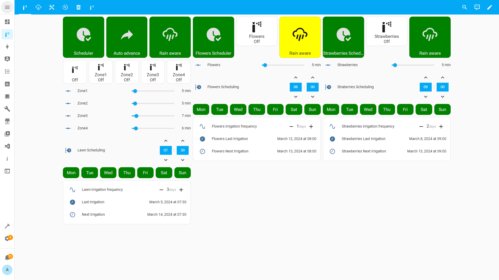
### Rain Dashboard
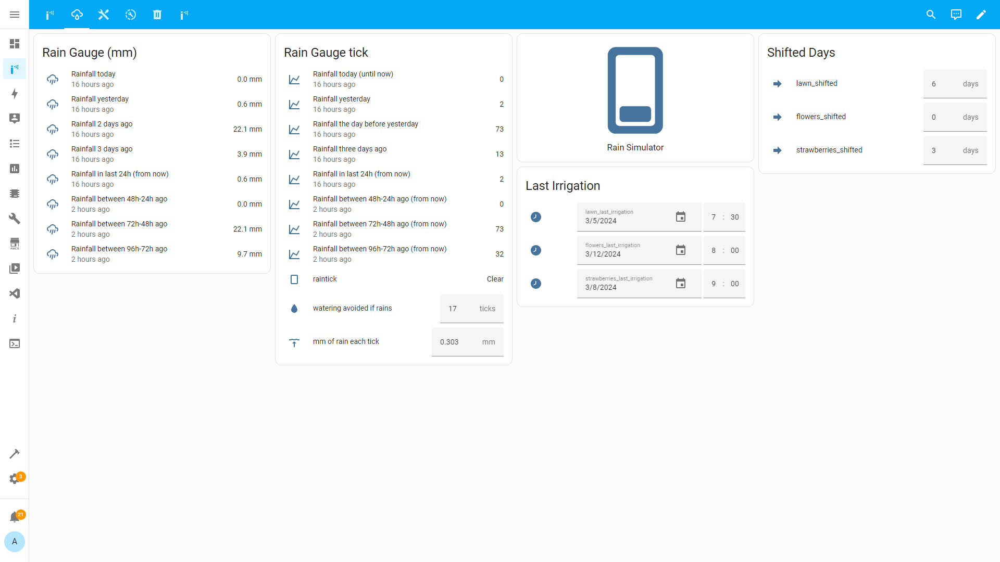
### Settings Dashboard
please pay attention on "Lawn Auto Advance" binary switch used to watering all sprinklers under a controller 
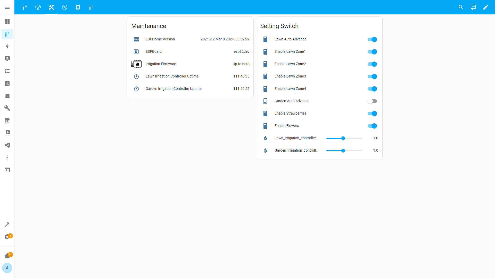
### Message Dashboard
(not used at the moment)
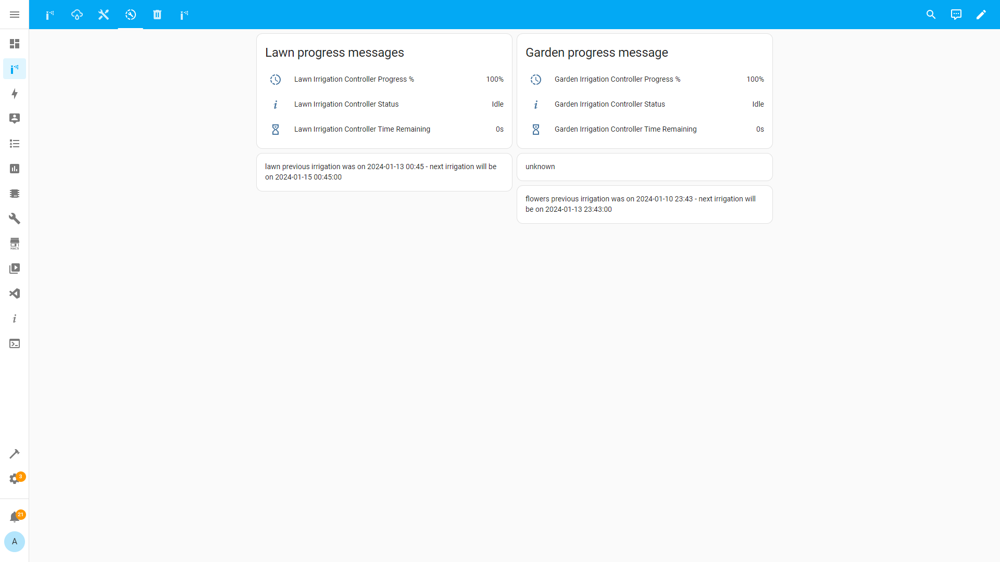
### Persistent Notification
Here you can find irrigation messages on delay, execution and future schedulings
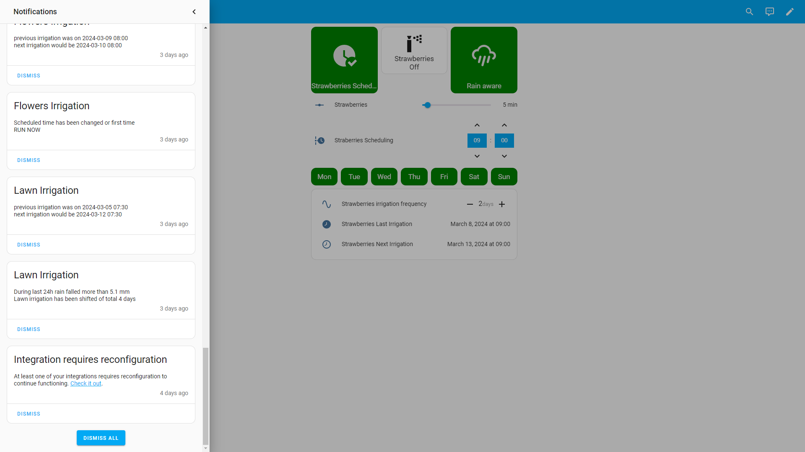
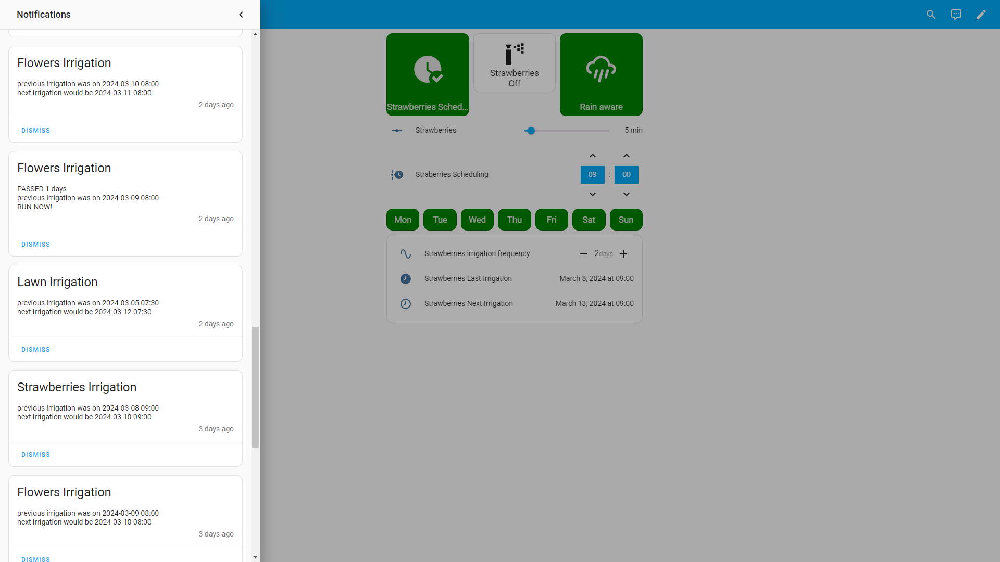
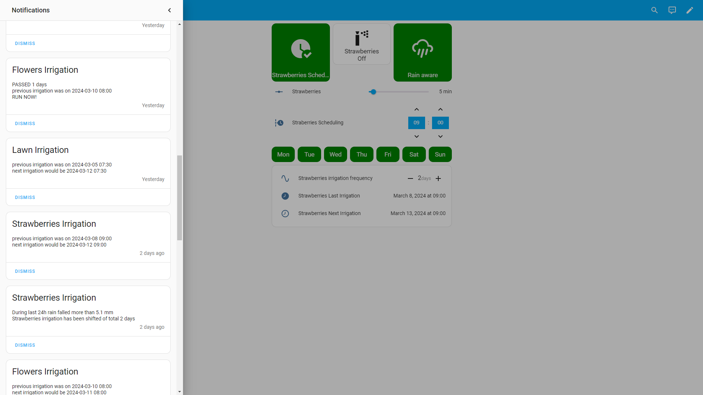
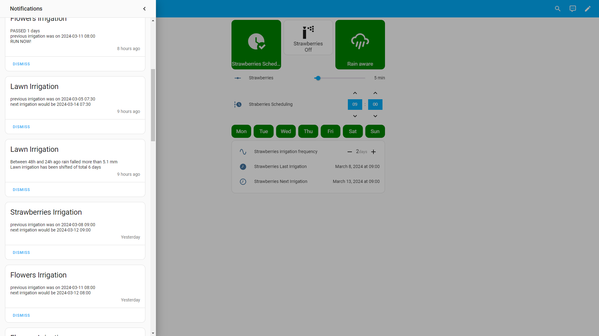
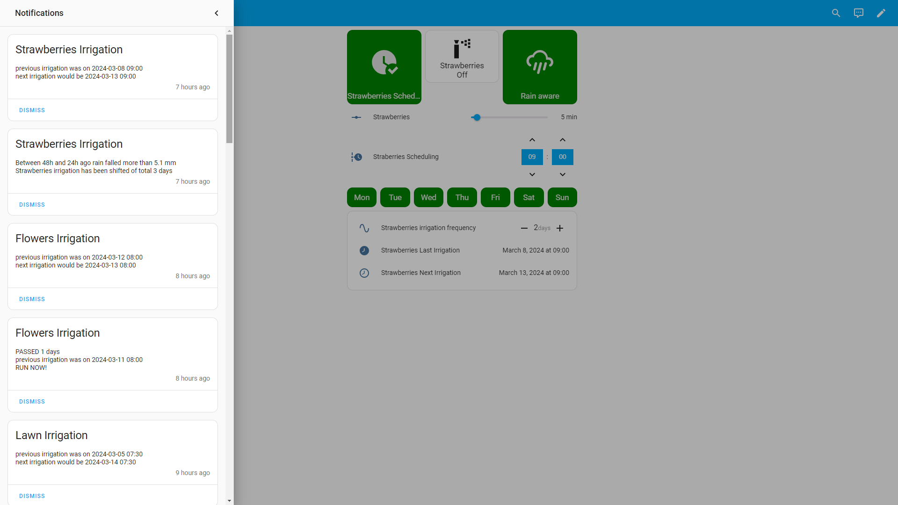
### Irrigation package:
add Studio Code Server add-on for your convenience
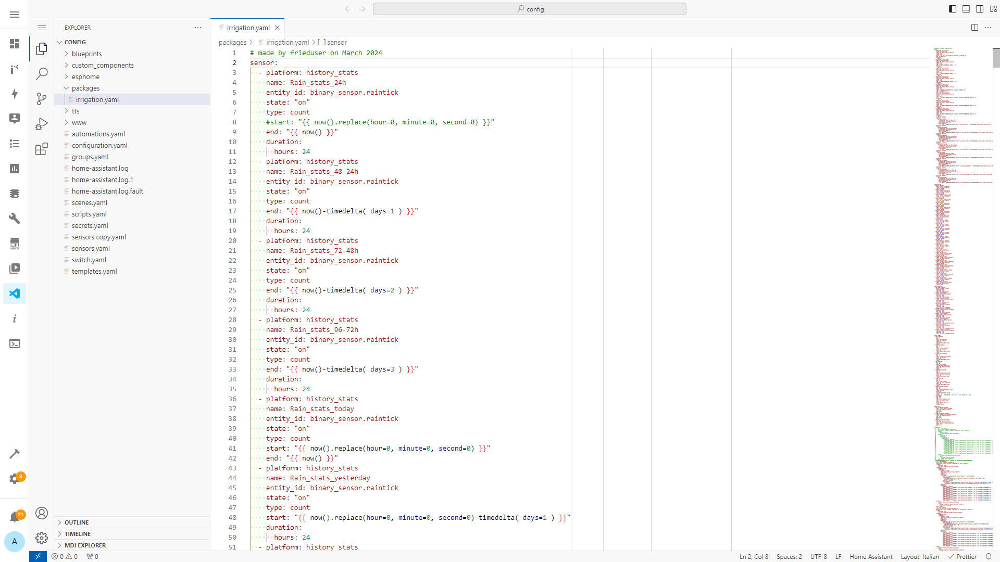
### ESPHome screnshot:
Just to show a part of the code
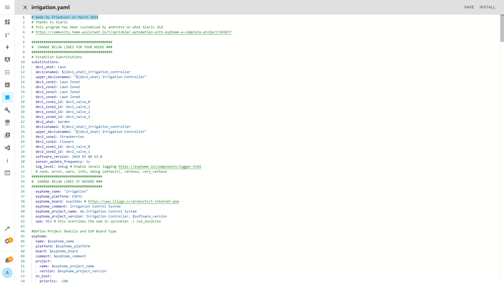

Credit: 
